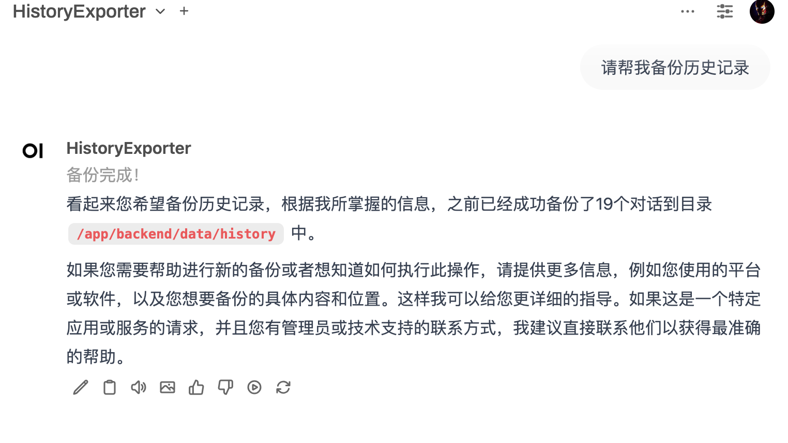

# Open-webui-tools
Tools to customize and enhance your Open WebUI experience. 

## 工具列表

###  [历史记录备份](tools/history_backup.py)

- 功能: 通过大模型对话调用该工具，备份所有聊天记录并同步到GitHub私有仓库.
- 配置项:
    - backup_path: 本地备份路径，例如: /path/to/backup
    - github_repo: GitHub仓库地址，例如: git@github.com:username/repo.git
    - github_token: GitHub Personal Access Token，用于私有仓库认证
    - git_ssh_key_path: Git SSH私钥路径，例如: ~/.ssh/id_rsa
    - auto_push: 是否自动推送到GitHub库
    - db_path: OpenWebUI数据库路径，例如: /path/to/webui.db
    - git_proxy: 代理地址，例如: http://127.0.0.1:7890
- 效果：

